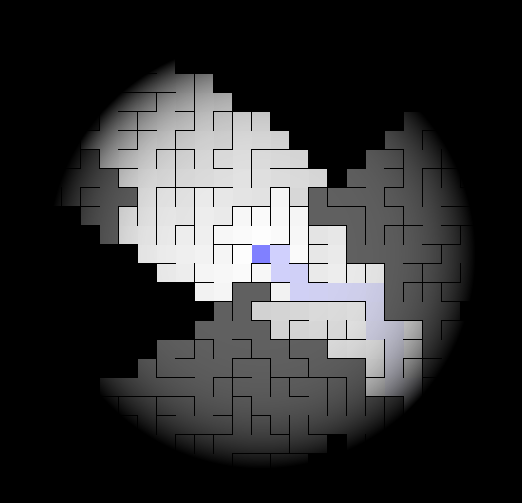

# Amazeing

Are you still sure that every acyclic maze can be easily solved by sticking
to the left (or right) wall? Try this one!

## Screenshots


## Controls
Keyboard                | Action
----------------------- | ------------
<kbd>&uparrow;</kbd>, <kbd>&leftarrow;</kbd>, <kbd>&rightarrow;</kbd>, <kbd>&downarrow;</kbd> | Move
<kbd>Space</kbd>        | Move one step backwards
<kbd>Esc</kbd>          | Return to main menu or exit game
<kbd>`</kbd>            | Use a hint

## Running
If you have never compiled Rust before, visit [rustup.rs](https://rustup.rs/) to install
compiler toolchain.

You will probably also need
[SDL2 development libraries](https://github.com/Rust-SDL2/rust-sdl2#sdl20-development-libraries).

After that compiling and running Amazeing is as easy as this:
```
$ cargo run --release
```
